## System Configuration

- **OS:** Linux Mint
- **GPU:** NVIDIA RTX 3090 (24GB)
- **RAM:** 16GB

## TLDR:
- Mamba architecture was added to the DeepSTPP paper.
- The code was also GPU optimized.

## Visual Represenations For MAMBA Results:

### Covid NJ Dataset

  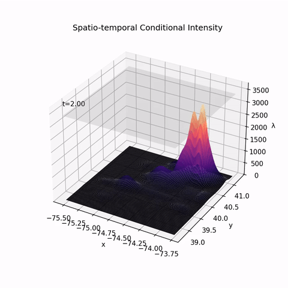
  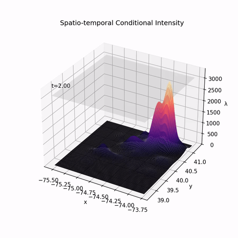
  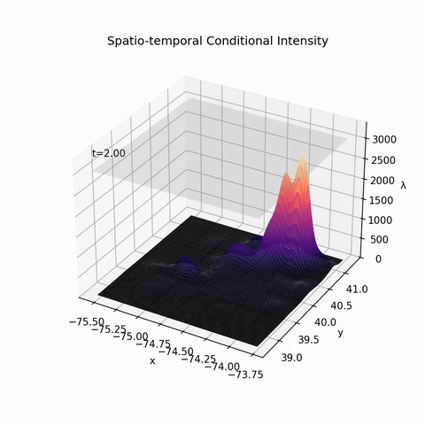

### Japanese Earthquake Dataset

  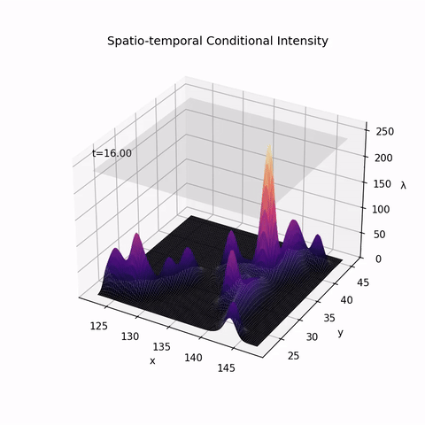
  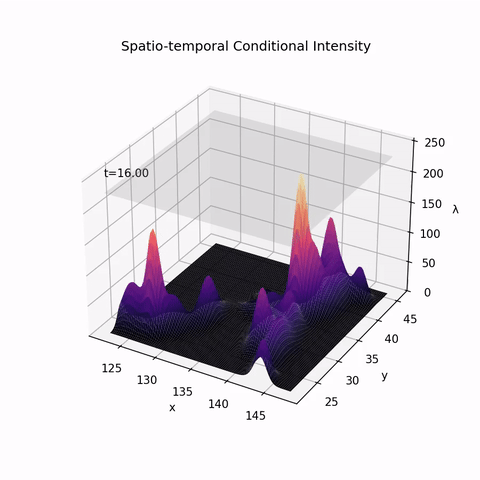
  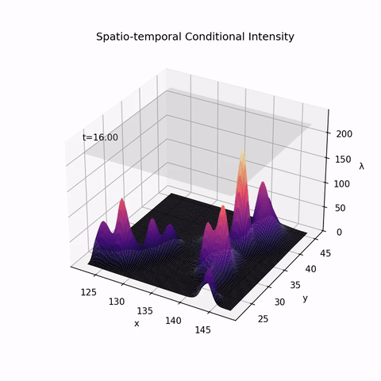

### Spatio Temporal Hawkes Process

  
  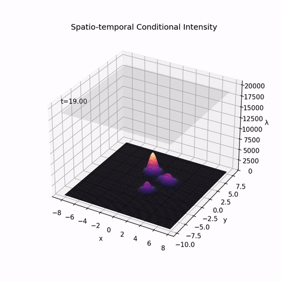
  

### Spatio Temporal Self-Correcting Process

  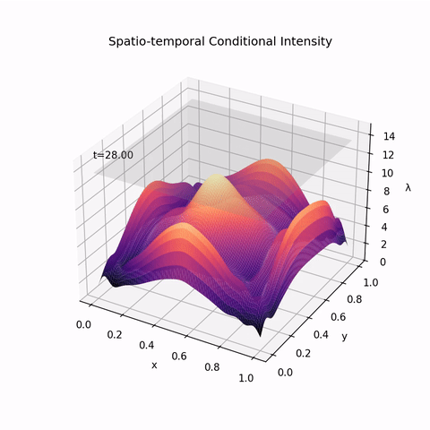
  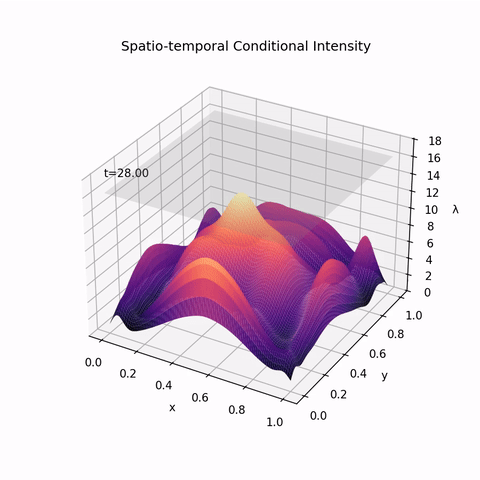
  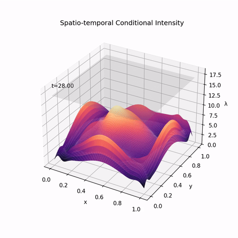

## Neural Point Process for Learning Spatiotemporal Event Dynamics (DeepSTPP) with Mamba Application

*Mamba Abstract* Spatiotemporal point processes (STPPs) provide a principled framework for modeling irregular event sequences over continuous space and time. DeepSTPP introduced a nonparametric kernel mixture approach with latent stochastic processes and amortized inference, using Transformer-based encoders to capture event history. However, Transformer encoders suffer from quadratic scaling with sequence length and may struggle to capture long-range dependencies efficiently. In this work, we propose DeepSTPP-Mamba, replacing the Transformer encoder with the recently developed Structured State Space Sequence Model, Mamba, which enables linear-time sequence modeling via selective state space dynamics. Extensive experiments on both synthetic and real-world continuous STPP datasets show that DeepSTPP-Mamba achieves comparable or superior forecasting accuracy while improving computational scalability. Our results suggest that structured state space models provide an effective alternative to attention-based architectures for continuous-time spatiotemporal event modeling.

## Original Deep Spatiotemporal Point Process [[Paper](https://proceedings.mlr.press/v168/zhou22a/zhou22a.pdf)]

**Zihao Zhou, Adam Yang, Ryan Rossi, Handong Zhao, Rose Yu**

In proceedings of *Annual Conference on Learning for Dynamics and Control* (L4DC), 2022

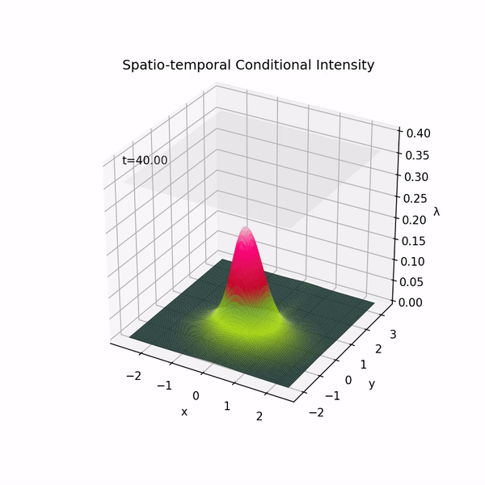

